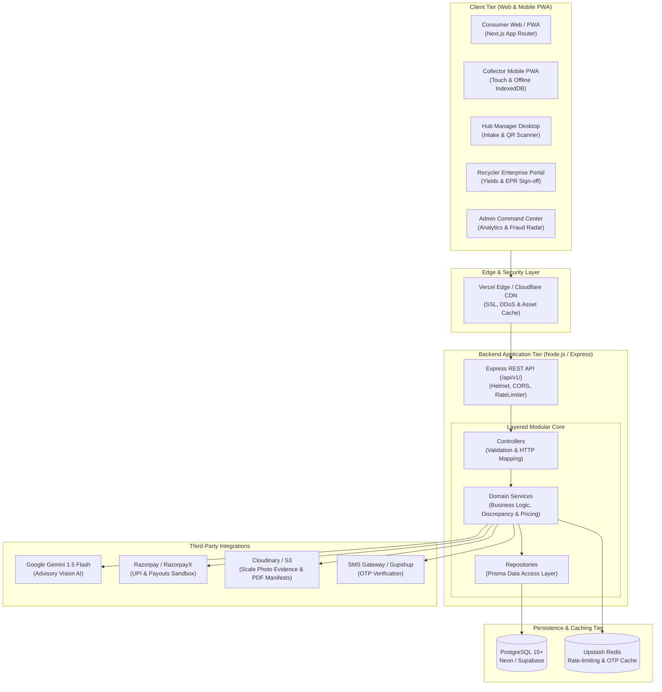
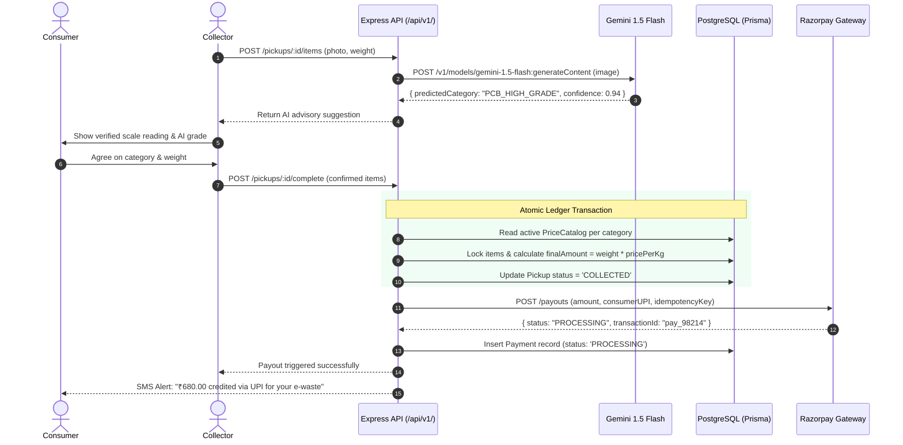
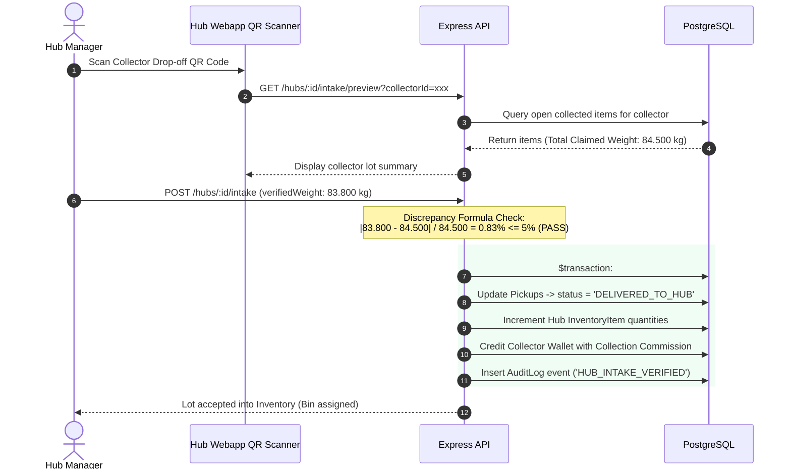

# System Architecture Document — EcoTrace India

**Document Version:** 1.0.0  
**Status:** Approved for Implementation  
**Project Architecture:** Standalone Two-Tier Decoupled Web Architecture  
**Traceability Code:** `ECO-ARCH-V1`

---

## 1. High-Level Architecture Overview

EcoTrace India is architected as two decoupled, independently deployable software repositories:
1. **Frontend Application (`frontend/`):** Next.js 14+ App Router hosted on Vercel.
2. **Backend API Service (`backend/`):** Express.js + TypeScript Layered Architecture hosted on Render or Railway, backed by PostgreSQL and Upstash Redis.



---

## 2. Component Boundaries & Layer Responsibilities

```text
HTTP Request
     |
     v
[Route Layer]         -> Maps HTTP method/URL, binds authentication & role-guard middleware
     |
     v
[Controller Layer]    -> Parses request body via Zod, handles HTTP status codes, invokes service
     |
     v
[Service Layer]       -> Encapsulates 100% of domain business logic (e.g. 5% discrepancy check, pricing formulas)
     |
     v
[Repository Layer]    -> Executes Prisma queries, database transactions, and raw Haversine SQL
     |
     v
[PostgreSQL Database] -> Physical ACID persistence
```

* **Zero Business Logic in Controllers:** Controllers simply translate HTTP inputs into domain service calls and format JSON response envelopes.
* **Service Independence:** Services never inspect raw `req` or `res` objects. They receive plain TypeScript interfaces, enabling effortless unit testing with Vitest.
* **Transaction Encapsulation:** Multi-table operations (e.g., deducting hub inventory and creating a sealed batch) run inside `prisma.$transaction()`.

---

## 3. End-to-End Sequence Diagrams

### 3.1 Doorstep Weigh-in, Pricing Lock & Consumer Payout



---

### 3.2 Hub Intake, Scale Verification & Discrepancy Flagging



---

## 4. Complete Project Directory Tree

The project is cleanly decoupled into two standalone deployment directories (`frontend/` and `backend/`) plus documentation:

```text
ECO TRACE INDIA/
├── docs/                                 # Complete Technical & Product Specifications
│   ├── PRD.md
│   ├── TRD.md
│   ├── UI_UX.md
│   ├── DB_SCHEMA.md
│   ├── ARCHITECTURE.md
│   ├── SECURITY.md
│   ├── TICKETS.md
│   └── RULES.md
│
├── frontend/                             # Standalone Next.js 14+ App Router Client
│   ├── public/
│   │   ├── icons/
│   │   ├── manifests/
│   │   └── images/
│   ├── src/
│   │   ├── app/                          # Next.js App Router Structure
│   │   │   ├── (public)/                 # Landing, About, Scrap Rates
│   │   │   │   ├── page.tsx
│   │   │   │   └── pricing/page.tsx
│   │   │   ├── (auth)/                   # Login, Register, OTP Verification
│   │   │   │   ├── login/page.tsx
│   │   │   │   └── register/page.tsx
│   │   │   ├── consumer/                 # Consumer Portal
│   │   │   │   ├── dashboard/page.tsx
│   │   │   │   ├── pickups/new/page.tsx
│   │   │   │   └── pickups/[id]/page.tsx
│   │   │   ├── collector/                # Collector Mobile-First PWA
│   │   │   │   ├── dashboard/page.tsx
│   │   │   │   ├── jobs/[id]/page.tsx
│   │   │   │   ├── weigh-in/[id]/page.tsx
│   │   │   │   └── wallet/page.tsx
│   │   │   ├── hub/                      # Hub Manager Operations
│   │   │   │   ├── dashboard/page.tsx
│   │   │   │   ├── intake/page.tsx
│   │   │   │   └── batches/new/page.tsx
│   │   │   ├── recycler/                 # Formal Recycler Operations
│   │   │   │   ├── dashboard/page.tsx
│   │   │   │   └── processing/page.tsx
│   │   │   ├── admin/                    # Central Operations Cockpit
│   │   │   │   ├── dashboard/page.tsx
│   │   │   │   ├── pricing/page.tsx
│   │   │   │   └── fraud/page.tsx
│   │   │   ├── layout.tsx
│   │   │   └── globals.css
│   │   ├── components/                   # Reusable UI Library
│   │   │   ├── ui/                       # shadcn/ui primitives (button, dialog, card, badge)
│   │   │   ├── layout/                   # Header, Sidebar, BottomNav
│   │   │   └── shared/                   # PhotoUploader, QrScanner, MetricCard
│   │   ├── hooks/                        # Custom React Hooks
│   │   │   ├── use-offline-sync.ts       # IndexedDB collector caching
│   │   │   └── use-auth.ts
│   │   ├── lib/                          # Utilities & Client SDKs
│   │   │   ├── api-client.ts             # Axios / Fetch client with token refresh
│   │   │   └── utils.ts
│   │   ├── stores/                       # Zustand Client Micro-Stores
│   │   │   ├── auth-store.ts
│   │   │   └── collector-cart-store.ts
│   │   └── types/                        # Client-side TypeScript interfaces
│   ├── .env.example
│   ├── next.config.js
│   ├── package.json
│   ├── tailwind.config.ts
│   └── tsconfig.json
│
└── backend/                              # Standalone Express.js + Prisma API Server
    ├── prisma/
    │   ├── schema.prisma                 # Master Database Model
    │   ├── seed.ts                       # Seed Categories & Initial Rates
    │   └── migrations/
    ├── src/
    │   ├── config/                       # Environment & Service Configuration
    │   │   ├── env.config.ts
    │   │   └── logger.ts                 # Pino structured logger
    │   ├── constants/                    # System Constants & Error Codes
    │   ├── controllers/                  # Thin HTTP Route Controllers
    │   │   ├── auth.controller.ts
    │   │   ├── pickup.controller.ts
    │   │   ├── hub.controller.ts
    │   │   ├── batch.controller.ts
    │   │   ├── recycler.controller.ts
    │   │   ├── payment.controller.ts
    │   │   └── admin.controller.ts
    │   ├── middlewares/                  # Express Middleware Pipeline
    │   │   ├── auth.middleware.ts        # JWT validation & Role checks
    │   │   ├── rate-limiter.middleware.ts# Redis token-bucket limiter
    │   │   ├── validate.middleware.ts    # Zod request validation
    │   │   └── error.middleware.ts       # Global error envelope formatter
    │   ├── routes/                       # Express Route Declarations
    │   │   ├── index.ts                  # /api/v1 router aggregation
    │   │   ├── auth.routes.ts
    │   │   ├── pickup.routes.ts
    │   │   ├── hub.routes.ts
    │   │   ├── batch.routes.ts
    │   │   └── admin.routes.ts
    │   ├── services/                     # 100% Core Business Logic
    │   │   ├── auth.service.ts
    │   │   ├── pickup.service.ts
    │   │   ├── pricing.service.ts
    │   │   ├── hub.service.ts
    │   │   ├── batch.service.ts
    │   │   ├── payment.service.ts        # Pluggable Razorpay / Mock Gateway
    │   │   ├── ai.service.ts             # Gemini Vision API with fallback
    │   │   ├── epr.service.ts            # PDF Certificate & SHA-256 Hash
    │   │   └── audit.service.ts
    │   ├── repositories/                 # Prisma DB Data Access Objects
    │   │   ├── user.repository.ts
    │   │   ├── pickup.repository.ts
    │   │   ├── hub.repository.ts
    │   │   └── batch.repository.ts
    │   ├── types/                        # Server Data Contracts & DTOs
    │   └── server.ts                     # Express App Initialization & Port Listen
    ├── tests/                            # Vitest & Supertest Test Suites
    │   ├── unit/                         # Pricing, Discrepancy & Logic tests
    │   └── integration/                  # End-to-end API route tests
    ├── .env.example
    ├── package.json
    ├── tsconfig.json
    └── vitest.config.ts
```

---

## 5. Scalability Strategy & Bottleneck Analysis

```text
+-------------------+----------------------------+-----------------------------------+-----------------------------------------+
| Stage / Users     | Typical Load Metrics       | What Breaks First                 | Engineering Architecture Upgrade        |
+-------------------+----------------------------+-----------------------------------+-----------------------------------------+
| **Stage 1 (MVP)** | 100 - 500 Daily Users      | Nothing; single Node.js process    | Deploy on free/cheap tiers              |
|                   | ~50 Pickups/day            | & Neon Postgres easily handles it.| (Vercel + Render + Neon free).          |
+-------------------+----------------------------+-----------------------------------+-----------------------------------------+
| **Stage 2**       | 10,000 - 50,000 Users      | 1. Neon DB connection exhaustion. | 1. Add Prisma PgBouncer connection pool.|
|                   | ~2,500 Pickups/day         | 2. Synchronous image uploads lag. | 2. Introduce BullMQ + Redis job worker  |
|                   |                            | 3. Geospatial queries slow down.  |    for async Cloudinary processing.     |
+-------------------+----------------------------+-----------------------------------+-----------------------------------------+
| **Stage 3**       | 500,000 - 1,000,000 Users  | 1. High write lock on Pickup table| 1. Read replicas for Analytics & Admin. |
|                   | ~75,000 Pickups/day        | 2. Monolithic Express API CPU sat.| 2. Horizontal auto-scaling on ECS/K8s.  |
|                   |                            | 3. High latency in Haversine SQL. | 3. Enable PostGIS R-Tree spatial index. |
+-------------------+----------------------------+-----------------------------------+-----------------------------------------+
```

---

## 6. Hosting Infrastructure Cost Breakdown

| Scale Stage | Monthly Active Users | Compute & Database Infrastructure | Estimated Total Cost (USD) |
| :--- | :--- | :--- | :--- |
| **Stage 1 (MVP / Demo)** | $< 1,000$ | Vercel Hobby ($0) + Render Free/Starter ($7) + Neon Postgres ($0) + Upstash ($0) | **$0 - $7 / month** |
| **Stage 2 (Pilot City)** | $10,000 - 50,000$ | Vercel Pro ($20) + Render Standard ($25) + Supabase Pro ($25) + Cloudinary ($25) | **~$95 / month** |
| **Stage 3 (National Multi-City)**| $500,000+$ | AWS ECS Fargate ($180) + AWS Aurora Postgres ($240) + Redis ($60) + S3 ($80) | **~$560 / month** |

---

## 7. Key Architecture Decision Records (ADR)

### ADR-01: Two Standalone Folders (`frontend/` and `backend/`) vs. Monorepo
* **Decision:** Maintain two completely distinct folders with separate `package.json` files rather than an npm/pnpm workspace monorepo.
* **Context:** The developer needs frictionless zero-configuration deployments to Vercel (pointing to `/frontend`) and Render/Railway (pointing to `/backend`). Monorepos frequently run into build path and dependency hoisting problems on free-tier platform hosting.
* **Trade-off:** Minimal duplication of TypeScript DTOs, offset by zero deployment friction.

### ADR-02: Advisory-Only Artificial Intelligence vs. Automated Decisioning
* **Decision:** The Google Gemini 1.5 Flash Vision API provides advisory categorization only; human operators (Collector and Consumer) retain final authority on recorded categories and weights.
* **Context:** Misclassifying a low-grade scrap item as high-grade precious metal PCB creates catastrophic economic leakage.
* **Trade-off:** Requires a human tap to confirm the grade, but guarantees complete economic safety.

### ADR-03: Indexed Coordinates with Haversine Formula vs. Native PostGIS
* **Decision:** Use standard floating-point `latitude` and `longitude` fields with raw SQL Haversine radius math for MVP proximity search.
* **Context:** PostGIS requires specialized database extensions that complicate local Docker setups and fail on certain serverless PostgreSQL free tiers.
* **Trade-off:** Slight math overhead on large point sets ($>100k$ points), but $100\%$ zero-setup compatibility everywhere.
