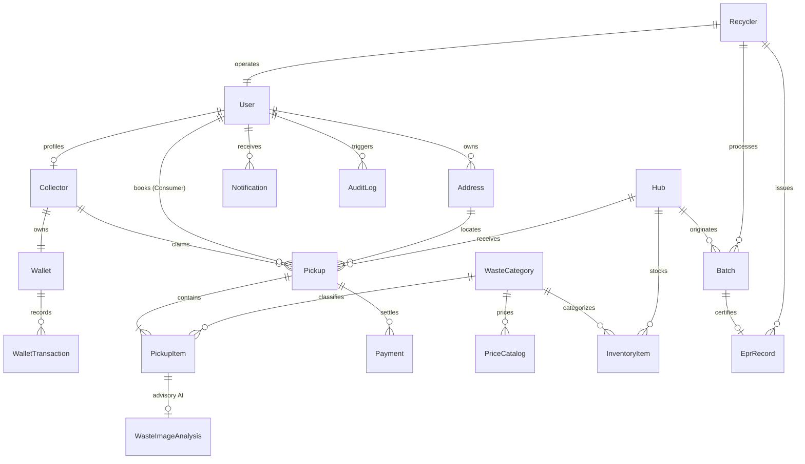

# Backend Database Schema Specification — EcoTrace India

**Document Version:** 1.0.0  
**Status:** Approved for Implementation  
**Target Database:** PostgreSQL 15+  
**ORM / Data Layer:** Prisma ORM  
**Traceability Code:** `ECO-DBSCHEMA-V1`

---

## 1. Database Choice & Technical Rationale

* **Database Engine:** **PostgreSQL 15+**
* **Primary Rationale:**
  * **Relational & ACID Integrity:** Physical reverse logistics involves multi-party custody transfers (Consumer $\rightarrow$ Collector $\rightarrow$ Hub $\rightarrow$ Recycler) and immutable financial payouts. ACID transaction guarantees prevent ghost inventory and phantom payouts.
  * **Precision Numerics:** PostgreSQL `Decimal(8,3)` ensures zero rounding errors on fractional weights (e.g. `0.025 kg` of high-grade gold-bearing circuit boards) and `Decimal(12,2)` for currency calculations.
  * **Geospatial Efficiency:** Indexed latitude and longitude fields allow high-speed bounding-box and Haversine distance calculations without requiring complex PostGIS dependencies on free serverless hosting (Neon/Supabase).
  * **Audit Immutability:** Native triggers and append-only audit tables provide legal compliance under India's Digital Personal Data Protection (DPDP) Act 2023 and CPCB E-Waste Management Rules.

---

## 2. Entity List & Domain Purpose

| Entity Model | Domain Purpose | Primary Key | Key Relationships |
| :--- | :--- | :--- | :--- |
| **`User`** | Central identity, credentials, roles, and communication preferences. | UUID | 1:1 Collector, 1:M Addresses, 1:M Pickups, 1:M AuditLogs. |
| **`Collector`** | Profile for informal/formal field agents (*kabadiwalas*, scrap dealers). | UUID | 1:1 User, 1:1 Wallet, 1:M Pickups. |
| **`Address`** | Physical geographic locations for consumer pickups and facilities. | UUID | M:1 User, 1:M Pickups. |
| **`WasteCategory`** | Standardized taxonomy of e-waste types with rate bounds. | UUID | 1:M PriceCatalogs, 1:M PickupItems, 1:M InventoryItems. |
| **`PriceCatalog`** | Historical & active regional scrap rates per kg. | UUID | M:1 WasteCategory. |
| **`Pickup`** | Core transactional entity tracking doorstep collection lifecycle. | UUID | M:1 Consumer, M:1 Collector, M:1 Hub, 1:M Items, 1:M Payments. |
| **`PickupItem`** | Line-item detail containing physical weight, photo proof, and valuation. | UUID | M:1 Pickup, M:1 WasteCategory, 1:1 WasteImageAnalysis. |
| **`Payment`** | Immutable financial ledger record for consumer payouts and fees. | UUID | M:1 Pickup, M:1 Payer, M:1 Payee. |
| **`Wallet`** | Digital escrow balance and earnings accumulator for field collectors. | UUID | 1:1 Collector, 1:M WalletTransactions. |
| **`WalletTransaction`**| Immutable double-entry ledger entry for collector credits/withdrawals. | UUID | M:1 Wallet. |
| **`Hub`** | Local material aggregation facility managing ward-level intake. | UUID | M:1 Manager (User), 1:M InventoryItems, 1:M Batches. |
| **`InventoryItem`** | Real-time aggregated weight balances per category at each hub. | UUID | M:1 Hub, M:1 WasteCategory. |
| **`Batch`** | Consolidated sealed shipment ready for recycler dispatch with QR code. | UUID | M:1 Hub, M:1 Recycler, M:1 WasteCategory, 1:1 EprRecord. |
| **`Recycler`** | Formal CPCB-registered recycling plant receiving batches. | UUID | 1:1 User, 1:M Batches, 1:M EprRecords. |
| **`EprRecord`** | CPCB-compliant digital Extended Producer Responsibility certificate. | UUID | 1:1 Batch, M:1 Recycler. |
| **`WasteImageAnalysis`**| Advisory AI vision grading records and confidence scores. | UUID | 1:1 PickupItem. |
| **`Notification`** | System alerts, dispatch updates, and OTP/SMS dispatch tracking. | UUID | M:1 User. |
| **`AuditLog`** | Immutable compliance trail of mutations on prices, weights, and roles. | UUID | M:1 Actor (User). |

---

## 3. Entity-Relationship (ER) Diagram



---

## 4. Complete Ready-to-Run Prisma Schema (`schema.prisma`)

```prisma
datasource db {
  provider = "postgresql"
  url      = env("DATABASE_URL")
}

generator client {
  provider = "prisma-client-js"
}

enum Role {
  CONSUMER
  COLLECTOR
  HUB_MANAGER
  RECYCLER
  ADMIN
}

enum CollectorType {
  KABADIWALA
  RAGPICKER
  JUNK_COLLECTOR
  FIELD_AGENT
  SCRAP_DEALER
}

enum VerificationStatus {
  PENDING
  VERIFIED
  REJECTED
  SUSPENDED
}

enum PickupStatus {
  REQUESTED
  ASSIGNED
  COLLECTOR_ARRIVED
  COLLECTED
  PAYMENT_PENDING
  COMPLETED
  CANCELLED
  DELIVERED_TO_HUB
  FLAGGED_DISCREPANCY
}

enum PaymentStatus {
  PENDING
  PROCESSING
  COMPLETED
  FAILED
  REFUNDED
}

enum PaymentMethod {
  UPI
  BANK_TRANSFER
  WALLET
  CASH
}

enum WalletTransactionType {
  CREDIT_COLLECTION_COMMISSION
  DEBIT_WITHDRAWAL
  ADJUSTMENT_DISCREPANCY
}

enum BatchStatus {
  OPEN
  SEALED
  IN_TRANSIT
  RECEIVED
  PROCESSING
  PROCESSED
  CANCELLED
}

enum CpcbSyncStatus {
  LOCAL_ONLY
  SYNC_PENDING
  SYNCED
  REJECTED
}

model User {
  id                String             @id @default(uuid()) @db.Uuid
  fullName          String             @db.VarChar(100)
  phone             String             @unique @db.VarChar(15)
  email             String?            @unique @db.VarChar(150)
  passwordHash      String?            @db.VarChar(255)
  role              Role               @default(CONSUMER)
  preferredLanguage String             @default("en") @db.VarChar(10)
  isVerified        Boolean            @default(false)
  status            String             @default("ACTIVE") @db.VarChar(20)
  createdAt         DateTime           @default(now()) @db.Timestamptz
  updatedAt         DateTime           @updatedAt @db.Timestamptz

  addresses         Address[]
  collectorProfile  Collector?
  recyclerProfile   Recycler?
  pickupsAsConsumer Pickup[]           @relation("ConsumerPickups")
  managedHubs       Hub[]              @relation("HubManager")
  sentPayments      Payment[]          @relation("PayerUser")
  receivedPayments  Payment[]          @relation("PayeeUser")
  notifications     Notification[]
  auditLogs         AuditLog[]

  @@index([phone])
  @@index([email])
  @@index([role, status])
}

model Collector {
  id                 String             @id @default(uuid()) @db.Uuid
  userId             String             @unique @db.Uuid
  collectorType      CollectorType      @default(KABADIWALA)
  serviceRadiusKm    Float              @default(10.0)
  verificationStatus VerificationStatus @default(PENDING)
  rating             Decimal            @default(5.00) @db.Decimal(3, 2)
  totalCollections   Int                @default(0)
  totalWeightKg      Decimal            @default(0.000) @db.Decimal(12, 3)
  createdAt          DateTime           @default(now()) @db.Timestamptz
  updatedAt          DateTime           @updatedAt @db.Timestamptz

  user               User               @relation(fields: [userId], references: [id], onDelete: Restrict)
  wallet             Wallet?
  claimedPickups     Pickup[]           @relation("CollectorPickups")

  @@index([userId])
  @@index([verificationStatus])
  @@index([collectorType])
}

model Address {
  id           String   @id @default(uuid()) @db.Uuid
  userId       String   @db.Uuid
  addressLine  String   @db.VarChar(255)
  city         String   @db.VarChar(100)
  state        String   @db.VarChar(100)
  postalCode   String   @db.VarChar(10)
  latitude     Float
  longitude    Float
  isDefault    Boolean  @default(false)
  createdAt    DateTime @default(now()) @db.Timestamptz

  user         User     @relation(fields: [userId], references: [id], onDelete: Cascade)
  pickups      Pickup[]

  @@index([userId])
  @@index([latitude, longitude])
  @@index([city, postalCode])
}

model WasteCategory {
  id             String          @id @default(uuid()) @db.Uuid
  code           String          @unique @db.VarChar(50) // e.g. PCB_HIGH_GRADE
  name           String          @db.VarChar(100)
  description    String?         @db.Text
  baseRatePerKg  Decimal         @db.Decimal(10, 2)
  minRatePerKg   Decimal         @db.Decimal(10, 2)
  maxRatePerKg   Decimal         @db.Decimal(10, 2)
  isActive       Boolean         @default(true)
  createdAt      DateTime        @default(now()) @db.Timestamptz
  updatedAt      DateTime        @updatedAt @db.Timestamptz

  priceCatalogs  PriceCatalog[]
  pickupItems    PickupItem[]
  inventoryItems InventoryItem[]
  batches        Batch[]

  @@index([code])
  @@index([isActive])
}

model PriceCatalog {
  id              String        @id @default(uuid()) @db.Uuid
  categoryId      String        @db.Uuid
  region          String        @default("NATIONAL") @db.VarChar(50)
  baseRatePerKg   Decimal       @db.Decimal(10, 2)
  minimumRatePerKg Decimal      @db.Decimal(10, 2)
  maximumRatePerKg Decimal      @db.Decimal(10, 2)
  effectiveFrom   DateTime      @default(now()) @db.Timestamptz
  effectiveTo     DateTime?     @db.Timestamptz
  updatedBy       String        @db.Uuid

  category        WasteCategory @relation(fields: [categoryId], references: [id], onDelete: Restrict)

  @@index([categoryId, region])
  @@index([effectiveFrom, effectiveTo])
}

model Pickup {
  id              String         @id @default(uuid()) @db.Uuid
  consumerId      String         @db.Uuid
  collectorId     String?        @db.Uuid
  hubId           String?        @db.Uuid
  addressId       String         @db.Uuid
  status          PickupStatus   @default(REQUESTED)
  scheduledDate   DateTime       @db.Date
  scheduledSlot   String         @db.VarChar(50)
  estimatedAmount Decimal        @default(0.00) @db.Decimal(10, 2)
  finalAmount     Decimal?       @db.Decimal(10, 2)
  latitude        Float
  longitude       Float
  notes           String?        @db.Text
  createdAt       DateTime       @default(now()) @db.Timestamptz
  updatedAt       DateTime       @updatedAt @db.Timestamptz

  consumer        User           @relation("ConsumerPickups", fields: [consumerId], references: [id], onDelete: Restrict)
  collector       Collector?     @relation("CollectorPickups", fields: [collectorId], references: [id], onDelete: SetNull)
  hub             Hub?           @relation(fields: [hubId], references: [id], onDelete: SetNull)
  address         Address        @relation(fields: [addressId], references: [id], onDelete: Restrict)
  items           PickupItem[]
  payments        Payment[]

  @@index([consumerId])
  @@index([collectorId])
  @@index([hubId])
  @@index([status])
  @@index([scheduledDate])
  @@index([latitude, longitude])
}

model PickupItem {
  id                String              @id @default(uuid()) @db.Uuid
  pickupId          String              @db.Uuid
  categoryId        String              @db.Uuid
  estimatedWeightKg Decimal             @default(0.000) @db.Decimal(8, 3)
  actualWeightKg    Decimal?            @db.Decimal(8, 3)
  pricePerKg        Decimal             @db.Decimal(10, 2)
  totalAmount       Decimal?            @db.Decimal(10, 2)
  imageProofUrl     String?             @db.VarChar(500)
  createdAt         DateTime            @default(now()) @db.Timestamptz

  pickup            Pickup              @relation(fields: [pickupId], references: [id], onDelete: Cascade)
  category          WasteCategory       @relation(fields: [categoryId], references: [id], onDelete: Restrict)
  aiAnalysis        WasteImageAnalysis?

  @@index([pickupId])
  @@index([categoryId])
}

model Payment {
  id             String        @id @default(uuid()) @db.Uuid
  pickupId       String        @db.Uuid
  payerId        String        @db.Uuid
  payeeId        String        @db.Uuid
  amount         Decimal       @db.Decimal(10, 2)
  paymentMethod  PaymentMethod @default(UPI)
  transactionId  String?       @unique @db.VarChar(100)
  idempotencyKey String        @unique @db.VarChar(100)
  status         PaymentStatus @default(PENDING)
  createdAt      DateTime      @default(now()) @db.Timestamptz
  completedAt    DateTime?     @db.Timestamptz

  pickup         Pickup        @relation(fields: [pickupId], references: [id], onDelete: Restrict)
  payer          User          @relation("PayerUser", fields: [payerId], references: [id], onDelete: Restrict)
  payee          User          @relation("PayeeUser", fields: [payeeId], references: [id], onDelete: Restrict)

  @@index([pickupId])
  @@index([status])
  @@index([idempotencyKey])
  @@index([transactionId])
}

model Wallet {
  id              String              @id @default(uuid()) @db.Uuid
  collectorId     String              @unique @db.Uuid
  balance         Decimal             @default(0.00) @db.Decimal(12, 2)
  totalEarned     Decimal             @default(0.00) @db.Decimal(12, 2)
  totalWithdrawn  Decimal             @default(0.00) @db.Decimal(12, 2)
  updatedAt       DateTime            @updatedAt @db.Timestamptz

  collector       Collector           @relation(fields: [collectorId], references: [id], onDelete: Cascade)
  transactions    WalletTransaction[]

  @@index([collectorId])
}

model WalletTransaction {
  id          String                @id @default(uuid()) @db.Uuid
  walletId    String                @db.Uuid
  type        WalletTransactionType
  amount      Decimal               @db.Decimal(10, 2)
  referenceId String?               @db.VarChar(100)
  description String                @db.VarChar(255)
  createdAt   DateTime              @default(now()) @db.Timestamptz

  wallet      Wallet                @relation(fields: [walletId], references: [id], onDelete: Restrict)

  @@index([walletId])
  @@index([type])
}

model Hub {
  id                 String          @id @default(uuid()) @db.Uuid
  name               String          @db.VarChar(150)
  managerId          String          @db.Uuid
  address            String          @db.VarChar(255)
  latitude           Float
  longitude          Float
  storageCapacityKg  Decimal         @db.Decimal(12, 3)
  licenseNumber      String          @unique @db.VarChar(100)
  status             String          @default("ACTIVE") @db.VarChar(20)
  createdAt          DateTime        @default(now()) @db.Timestamptz
  updatedAt          DateTime        @updatedAt @db.Timestamptz

  manager            User            @relation("HubManager", fields: [managerId], references: [id], onDelete: Restrict)
  pickups            Pickup[]
  inventoryItems     InventoryItem[]
  batches            Batch[]

  @@index([managerId])
  @@index([latitude, longitude])
  @@index([status])
}

model InventoryItem {
  id          String        @id @default(uuid()) @db.Uuid
  hubId       String        @db.Uuid
  categoryId  String        @db.Uuid
  quantityKg  Decimal       @default(0.000) @db.Decimal(12, 3)
  storageBin  String        @db.VarChar(50)
  updatedAt   DateTime      @updatedAt @db.Timestamptz

  hub         Hub           @relation(fields: [hubId], references: [id], onDelete: Cascade)
  category    WasteCategory @relation(fields: [categoryId], references: [id], onDelete: Restrict)

  @@unique([hubId, categoryId, storageBin])
  @@index([hubId])
  @@index([categoryId])
}

model Batch {
  id             String         @id @default(uuid()) @db.Uuid
  batchCode      String         @unique @db.VarChar(50)
  hubId          String         @db.Uuid
  recyclerId     String?        @db.Uuid
  categoryId     String         @db.Uuid
  grossWeightKg  Decimal        @db.Decimal(12, 3)
  netWeightKg    Decimal        @db.Decimal(12, 3)
  status         BatchStatus    @default(OPEN)
  qrCode         String         @unique @db.VarChar(255)
  manifestUrl    String?        @db.VarChar(500)
  shippedAt      DateTime?      @db.Timestamptz
  receivedAt     DateTime?      @db.Timestamptz
  createdAt      DateTime       @default(now()) @db.Timestamptz

  hub            Hub            @relation(fields: [hubId], references: [id], onDelete: Restrict)
  recycler       Recycler?      @relation(fields: [recyclerId], references: [id], onDelete: SetNull)
  category       WasteCategory  @relation(fields: [categoryId], references: [id], onDelete: Restrict)
  eprRecord      EprRecord?

  @@index([batchCode])
  @@index([hubId])
  @@index([recyclerId])
  @@index([status])
}

model Recycler {
  id                 String             @id @default(uuid()) @db.Uuid
  userId             String             @unique @db.Uuid
  companyName        String             @db.VarChar(200)
  licenseNumber      String             @unique @db.VarChar(100) // CPCB Registration
  address            String             @db.VarChar(255)
  city               String             @db.VarChar(100)
  state              String             @db.VarChar(100)
  contactNumber      String             @db.VarChar(15)
  verificationStatus VerificationStatus @default(PENDING)
  createdAt          DateTime           @default(now()) @db.Timestamptz
  updatedAt          DateTime           @updatedAt @db.Timestamptz

  user               User               @relation(fields: [userId], references: [id], onDelete: Restrict)
  batches            Batch[]
  eprRecords         EprRecord[]

  @@index([userId])
  @@index([licenseNumber])
  @@index([verificationStatus])
}

model EprRecord {
  id                String         @id @default(uuid()) @db.Uuid
  batchId           String         @unique @db.Uuid
  recyclerId        String         @db.Uuid
  certificateNumber String         @unique @db.VarChar(100)
  certifiedWeightKg Decimal        @db.Decimal(12, 3)
  issuedTo          String         @db.VarChar(200) // Brand / Producer Name
  certificateUrl    String         @db.VarChar(500)
  cpcbSyncStatus    CpcbSyncStatus @default(LOCAL_ONLY)
  issuedAt          DateTime       @default(now()) @db.Timestamptz

  batch             Batch          @relation(fields: [batchId], references: [id], onDelete: Restrict)
  recycler          Recycler       @relation(fields: [recyclerId], references: [id], onDelete: Restrict)

  @@index([certificateNumber])
  @@index([recyclerId])
  @@index([cpcbSyncStatus])
}

model WasteImageAnalysis {
  id                String     @id @default(uuid()) @db.Uuid
  pickupItemId      String     @unique @db.Uuid
  imageUrl          String     @db.VarChar(500)
  predictedCategory String     @db.VarChar(100)
  confidenceScore   Decimal    @db.Decimal(5, 4)
  fraudRiskScore    Decimal    @default(0.0000) @db.Decimal(5, 4)
  createdAt         DateTime   @default(now()) @db.Timestamptz

  pickupItem        PickupItem @relation(fields: [pickupItemId], references: [id], onDelete: Cascade)

  @@index([pickupItemId])
}

model Notification {
  id        String   @id @default(uuid()) @db.Uuid
  userId    String   @db.Uuid
  title     String   @db.VarChar(150)
  message   String   @db.Text
  type      String   @default("INFO") @db.VarChar(50)
  isRead    Boolean  @default(false)
  createdAt DateTime @default(now()) @db.Timestamptz

  user      User     @relation(fields: [userId], references: [id], onDelete: Cascade)

  @@index([userId, isRead])
}

model AuditLog {
  id         String   @id @default(uuid()) @db.Uuid
  userId     String?  @db.Uuid
  action     String   @db.VarChar(100)
  entityType String   @db.VarChar(50)
  entityId   String   @db.VarChar(100)
  oldValue   Json?    @db.JsonB
  newValue   Json?    @db.JsonB
  ipAddress  String?  @db.VarChar(45)
  createdAt  DateTime @default(now()) @db.Timestamptz

  actor      User?    @relation(fields: [userId], references: [id], onDelete: SetNull)

  @@index([entityType, entityId])
  @@index([userId])
  @@index([createdAt])
}
```

---

## 5. Seed Data Strategy & Initial Catalogs

The database seed script (`backend/prisma/seed.ts`) populates initial Indian e-waste categories and benchmark scrap rates:

```typescript
// Initial Seed Categories
const initialCategories = [
  { code: 'PCB_HIGH_GRADE', name: 'High-Grade Telecom/Server PCBs', baseRate: 450.00, minRate: 400.00, maxRate: 600.00 },
  { code: 'PCB_LOW_GRADE', name: 'Low-Grade Consumer Electronics PCBs', baseRate: 120.00, minRate: 90.00, maxRate: 160.00 },
  { code: 'LITHIUM_BATTERY', name: 'Lithium-Ion / Polymer Battery Packs', baseRate: 110.00, minRate: 80.00, maxRate: 150.00 },
  { code: 'DISPLAY_UNIT', name: 'LCD / LED Monitors and TV Screens', baseRate: 35.00, minRate: 20.00, maxRate: 50.00 },
  { code: 'MIXED_APPLIANCE', name: 'Mixed Small Domestic Appliances', baseRate: 28.00, minRate: 15.00, maxRate: 40.00 },
  { code: 'PLASTIC_CASING', name: 'Flame-Retardant Electronics Plastics', baseRate: 14.00, minRate: 8.00, maxRate: 22.00 },
  { code: 'METALS', name: 'Copper Coils & Structural Aluminium', baseRate: 280.00, minRate: 220.00, maxRate: 350.00 },
  { code: 'OTHER_E_WASTE', name: 'Cables, Adapters & Miscellaneous', baseRate: 40.00, minRate: 25.00, maxRate: 60.00 },
];
```

---

## 6. Data Immutability, Soft Deletes & Archival Conventions

1. **Strict Forbid on Hard Deletions:** No `DELETE` queries are executed on `Payment`, `Pickup`, `PickupItem`, `Batch`, `EprRecord`, or `WalletTransaction`.
2. **Audit Logging Middleware:** Any change in user roles, administrative pricing, or lot discrepancy approval writes an append-only snapshot to `AuditLog`.
3. **Data Retention:** Under Indian CPCB regulations, all batch manifests, weighing proofs, and EPR records must be retained in active database storage for a minimum of **5 years**.
