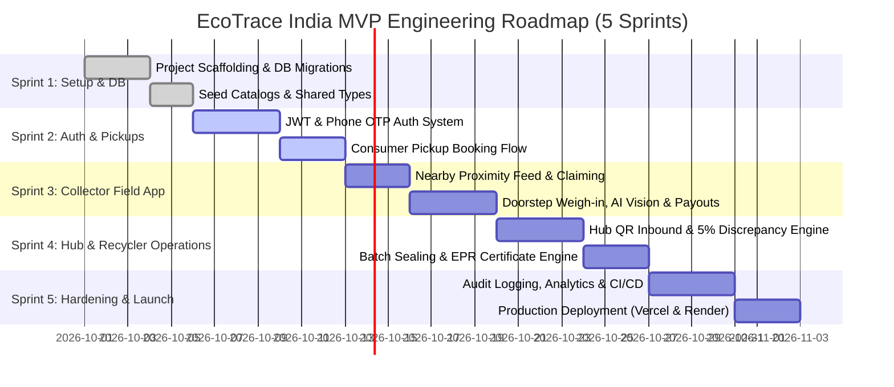

# Feature Ticket List & Sprint Plan — EcoTrace India

**Document Version:** 1.0.0  
**Target Release:** MVP v1.0  
**Project Architecture:** Standalone Two-Tier (`frontend/` and `backend/`)  
**Traceability Code:** `ECO-TICK-V1`

---

## 1. Sprint Roadmap Overview

---

## 2. Granular Ticket Specifications

### Epic 1: Project Scaffolding & Database Infrastructure

#### `TICK-001`: Initialize Standalone Frontend & Backend Workspaces
* **Epic:** Infrastructure
* **Priority:** **P0** | **Estimate:** Small (2 SP)
* **Labels:** `setup`, `frontend`, `backend`, `ci`
* **User Story:** *As a developer, I want two standalone folders for frontend and backend so that each can be deployed independently to Vercel and Render.*
* **Acceptance Criteria:**
  * **Given** the root project folder, **When** inspecting directories, **Then** `frontend/` (Next.js 14) and `backend/` (Express.js) exist with their own `package.json` files.
  * Running `npm run dev` in `frontend/` boots Next.js at `localhost:3000`.
  * Running `npm run dev` in `backend/` boots Express at `localhost:5000`.
* **Dependencies:** None
* **Definition of Done:** Both applications boot locally without errors; `.env.example` templates exist.

#### `TICK-002`: Prisma Database Schema Setup, Migration & Seeding
* **Epic:** Database
* **Priority:** **P0** | **Estimate:** Medium (3 SP)
* **Labels:** `db`, `backend`, `prisma`
* **User Story:** *As a backend engineer, I want the complete PostgreSQL schema implemented in Prisma so that all 18 domain models are ready for transactions.*
* **Acceptance Criteria:**
  * **Given** the `DB_SCHEMA.md` specification, **When** running `npx prisma migrate dev --name init`, **Then** all tables (`User`, `Pickup`, `Batch`, `Payment`, etc.) are created in PostgreSQL with required indexes.
  * Running `npx prisma db seed` successfully inserts the 8 standardized Indian e-waste categories with default per-kg scrap rates.
* **Dependencies:** `TICK-001`
* **Definition of Done:** Migration passes cleanly; seed script populates data without errors.

---

### Epic 2: Authentication, Security & Profiles

#### `TICK-003`: Dual-Mode Authentication Service (OTP + Password)
* **Epic:** Authentication
* **Priority:** **P0** | **Estimate:** Medium (3 SP)
* **Labels:** `backend`, `security`, `auth`
* **User Story:** *As an informal collector or consumer, I want to authenticate via phone OTP so that I do not need to remember complex passwords.*
* **Acceptance Criteria:**
  * **Given** an Indian phone number (`9876543210`), **When** calling `POST /api/v1/auth/send-otp`, **Then** a 6-digit OTP is generated and cached in Redis with a 300s TTL (logged to console in dev mode).
  * **When** calling `POST /api/v1/auth/verify-otp` with valid OTP, **Then** an HTTP-only refresh token cookie is set and a short-lived JWT access token is returned.
* **Dependencies:** `TICK-002`
* **Definition of Done:** Unit tests confirm OTP expiration and token issuance.

#### `TICK-004`: Server-Side Role-Based Access Control (RBAC) Middleware
* **Epic:** Security
* **Priority:** **P0** | **Estimate:** Small (2 SP)
* **Labels:** `backend`, `security`
* **User Story:** *As a security engineer, I want server-side RBAC guards so that consumers cannot execute collector or hub operations.*
* **Acceptance Criteria:**
  * **Given** a request to `/api/v1/hubs/:id/intake`, **When** the authenticated user role is `CONSUMER`, **Then** the API returns `403 Forbidden` with a standardized error envelope.
  * **When** the authenticated user role is `HUB_MANAGER`, **Then** the request passes through to the controller.
* **Dependencies:** `TICK-003`
* **Definition of Done:** Middleware test suite passes for all 5 roles.

---

### Epic 3: Consumer Pickup Request Workflow

#### `TICK-005`: Consumer Pickup Booking API
* **Epic:** Pickups
* **Priority:** **P0** | **Estimate:** Medium (3 SP)
* **Labels:** `backend`, `api`
* **User Story:** *As a consumer, I want to create a doorstep e-waste pickup request with estimated weights so that collectors can discover my job.*
* **Acceptance Criteria:**
  * **Given** a valid consumer token, **When** calling `POST /api/v1/pickups` with item categories, address coordinates, and time slot, **Then** a new `Pickup` record is created with status `REQUESTED`.
  * The system computes `estimatedAmount` using current category catalog rates.
* **Dependencies:** `TICK-002`, `TICK-004`
* **Definition of Done:** Endpoint validated via Supertest; returns `201 Created` with pickup ID.

#### `TICK-006`: Consumer 3-Step Pickup Booking UI (Stitch-Matched)
* **Epic:** Frontend
* **Priority:** **P0** | **Estimate:** Medium (3 SP)
* **Labels:** `frontend`, `ui/ux`
* **User Story:** *As a consumer, I want an intuitive 3-step UI to book my e-waste pickup with real-time scrap valuation.*
* **Acceptance Criteria:**
  * **Given** `/consumer/pickups/new`, **When** the user selects categories and adjusts the weight slider, **Then** an estimated payout range in ₹ updates dynamically.
  * Submitting the form navigates to `/consumer/pickups/[id]` displaying the live status tracker.
* **Dependencies:** `TICK-005`
* **Definition of Done:** Form validates with Zod; matches Stitch design tokens.

---

### Epic 4: Collector Field Application (Mobile-First)

#### `TICK-007`: Nearby Proximity Job Discovery API (Haversine Formula)
* **Epic:** Collector Operations
* **Priority:** **P0** | **Estimate:** Medium (3 SP)
* **Labels:** `backend`, `geospatial`
* **User Story:** *As a field collector, I want to view open pickup jobs within 10 km so that I can claim nearby work.*
* **Acceptance Criteria:**
  * **Given** collector coordinates (`lat`, `lng`), **When** calling `GET /api/v1/pickups/nearby`, **Then** returns open pickups (`status = 'REQUESTED'`) sorted by distance in km.
  * Only pickups within `serviceRadiusKm` are returned.
* **Dependencies:** `TICK-005`
* **Definition of Done:** Raw SQL Haversine query executes in $<50\text{ ms}$; verified via integration tests.

#### `TICK-008`: Atomic Pickup Claiming & Doorstep Weigh-in API
* **Epic:** Collector Operations
* **Priority:** **P0** | **Estimate:** Medium (5 SP)
* **Labels:** `backend`, `transactions`
* **User Story:** *As a collector, I want to claim a job and record weights and scale photos so that the scrap is accurately valued.*
* **Acceptance Criteria:**
  * **Given** an open pickup, **When** calling `PATCH /api/v1/pickups/:id/claim`, **Then** the pickup status updates to `ASSIGNED` in an atomic transaction preventing concurrent race conditions.
  * Calling `POST /api/v1/pickups/:id/items` accepts actual weight ($\le 3$ decimals), locks `pricePerKg`, and stores the photo URL.
* **Dependencies:** `TICK-007`
* **Definition of Done:** Unit test confirms double-claim conflict handling (`409 Conflict`).

#### `TICK-009`: Advisory Gemini Vision Waste Classifier
* **Epic:** AI Services
* **Priority:** **P1** | **Estimate:** Medium (3 SP)
* **Labels:** `backend`, `ai`
* **User Story:** *As a collector, I want AI to analyze my scrap photo and suggest the material grade so that I can classify items faster.*
* **Acceptance Criteria:**
  * **Given** an uploaded photo of a circuit board, **When** calling `POST /api/v1/ai/classify-waste`, **Then** the Gemini 1.5 Flash service returns `{ predictedCategory: "PCB_HIGH_GRADE", confidence: 0.94 }`.
  * If the Gemini API fails or times out, the endpoint returns a graceful fallback without throwing an unhandled exception.
* **Dependencies:** `TICK-008`
* **Definition of Done:** Fallback test passes when API key is omitted.

#### `TICK-010`: Collector Mobile Weigh-in Screen & Offline PWA Sync
* **Epic:** Frontend
* **Priority:** **P0** | **Estimate:** Large (5 SP)
* **Labels:** `frontend`, `pwa`, `mobile`
* **User Story:** *As a collector in a basement with no network, I want to record scrap weights locally so that I can sync when connectivity returns.*
* **Acceptance Criteria:**
  * **Given** offline network state, **When** recording weight and photo, **Then** the item is stored in browser IndexedDB with an "Offline - Saved Locally" banner.
  * When network reconnects, items are automatically submitted to the backend.
* **Dependencies:** `TICK-008`, `TICK-009`
* **Definition of Done:** Tested in Chrome DevTools offline throttling mode.

---

### Epic 5: Payments, Settlements & Collector Wallet

#### `TICK-011`: Idempotent Payment & Payout Engine (Razorpay + Mock)
* **Epic:** Financials
* **Priority:** **P0** | **Estimate:** Medium (5 SP)
* **Labels:** `backend`, `payments`, `security`
* **User Story:** *As a consumer, I want my scrap payout credited immediately via UPI without risk of double-charging.*
* **Acceptance Criteria:**
  * **Given** a payout request, **When** `POST /api/v1/payments` is called with an `Idempotency-Key` header, **Then** payment is processed via `IPaymentService` (Mock or RazorpayX).
  * Repeating the request with the identical key returns the original result without executing a second payment.
* **Dependencies:** `TICK-008`
* **Definition of Done:** Idempotency test suite executes 10 duplicate concurrent requests verifying only 1 ledger entry is created.

---

### Epic 6: Hub Aggregation, Reconciliation & Batching

#### `TICK-012`: Hub Scale Intake & 5% Weight Discrepancy Engine
* **Epic:** Hub Operations
* **Priority:** **P0** | **Estimate:** Medium (5 SP)
* **Labels:** `backend`, `business-logic`
* **User Story:** *As a hub manager, I want the system to check inbound weights against collector claimed weights so that stock tampering is caught.*
* **Acceptance Criteria:**
  * **Given** an inbound collector lot, **When** the hub manager inputs bulk verified weight, **Then** if the difference exceeds $5\%$, the lot transitions to `FLAGGED_DISCREPANCY` and creates an Admin alert.
  * If the difference is $\le 5\%$, the lot is accepted, hub inventory increments, and the collector's wallet is credited.
* **Dependencies:** `TICK-011`
* **Definition of Done:** Unit tests verify $4.9\%$ passes and $5.1\%$ locks the transaction.

#### `TICK-013`: Batch Consolidation & QR Code Manifest Generator
* **Epic:** Hub Operations
* **Priority:** **P0** | **Estimate:** Medium (3 SP)
* **Labels:** `backend`, `logistics`
* **User Story:** *As a hub manager, I want to consolidate inventory into a sealed batch with a printable QR manifest for formal recycler dispatch.*
* **Acceptance Criteria:**
  * **Given** inventory items, **When** calling `POST /api/v1/batches/:id/seal`, **Then** a unique `batchCode` and QR code payload (`ecotrace://batch/<UUID>`) are generated and the batch status updates to `SEALED`.
* **Dependencies:** `TICK-012`
* **Definition of Done:** QR code scans correctly and returns verifiable batch metadata.

---

### Epic 7: Recycler Processing & EPR Compliance

#### `TICK-014`: Recycler Batch Yield Recovery & Processing API
* **Epic:** Recycling
* **Priority:** **P0** | **Estimate:** Medium (3 SP)
* **Labels:** `backend`, `recycling`
* **User Story:** *As an authorized recycler, I want to record recovered copper, gold, and plastics from batches so that recycling yields are documented.*
* **Acceptance Criteria:**
  * **Given** an incoming batch, **When** calling `POST /api/v1/recyclers/:id/process`, **Then** metallurgical and plastic yield weights are recorded and batch status becomes `PROCESSED`.
* **Dependencies:** `TICK-013`
* **Definition of Done:** Validates that total output yield corresponds logically to input batch weight.

#### `TICK-015`: CPCB-Compliant EPR Digital Certificate Generator (PDF + SHA-256)
* **Epic:** Compliance
* **Priority:** **P0** | **Estimate:** Medium (3 SP)
* **Labels:** `backend`, `compliance`
* **User Story:** *As an enterprise brand, I want a tamper-evident CPCB EPR certificate with a digital SHA-256 hash verifying my recycling quota.*
* **Acceptance Criteria:**
  * **Given** a processed batch, **When** calling `POST /api/v1/epr`, **Then** an `EprRecord` is created, a signed PDF certificate is rendered via `pdfkit`, and its SHA-256 hash is permanently recorded.
* **Dependencies:** `TICK-014`
* **Definition of Done:** Generated PDF downloads correctly with readable QR verification.

---

### Epic 8: Governance, Monitoring & Production Deployment

#### `TICK-016`: Administrative Fraud Cockpit & Real-Time Analytics
* **Epic:** Governance
* **Priority:** **P0** | **Estimate:** Medium (3 SP)
* **Labels:** `frontend`, `analytics`, `admin`
* **User Story:** *As a platform administrator, I want to view platform-wide tonnage, active collectors, and high-priority discrepancy alerts.*
* **Acceptance Criteria:**
  * **Given** `/admin/dashboard`, **When** loaded by an `ADMIN` user, **Then** KPI metric cards (Total Weight, Payouts, Discrepancies) render accurately from `/api/v1/admin/analytics`.
* **Dependencies:** `TICK-012`, `TICK-015`
* **Definition of Done:** Recharts components render responsive charts without hydration errors.

#### `TICK-017`: Production CI/CD Pipeline & Deployment (Vercel + Render)
* **Epic:** DevOps
* **Priority:** **P0** | **Estimate:** Small (2 SP)
* **Labels:** `devops`, `deployment`
* **User Story:** *As a developer, I want automated GitHub Actions testing and deployment so that changes are verified before hitting production.*
* **Acceptance Criteria:**
  * **Given** a git push to `main`, **When** CI executes, **Then** frontend linter/build passes and backend Vitest suite passes.
  * Vercel deploys `frontend/`; Render deploys `backend/`.
* **Dependencies:** All prior tickets.
* **Definition of Done:** Production URLs respond with status `200 OK` on health check endpoints.
