# UI/UX Specification Document — EcoTrace India

**Document Version:** 1.0.0  
**Status:** Stitch-Ready Production Spec  
**Target Design Tool:** Google Stitch & Modern Web UI  
**Traceability Code:** `ECO-UIUX-V1`

---

## 1. Master Stitch Prompt (Global Look & Feel)

*Copy and paste this master prompt into Google Stitch before generating individual screens:*

```text
Design a clean, modern, and credible enterprise environmental technology platform named "EcoTrace India". 
The aesthetic balances professional logistics and circular-economy sustainability: crisp white and light emerald backgrounds (#F8FAF9, #FFFFFF), deep slate text (#0F172A), vibrant environmental forest green primary accents (#059669 / #10B981), trustworthy oceanic blue secondary accents (#0284C7), and subtle warm neutral borders (#E2E8F0). 
Typography is clear and readable using Inter or Plus Jakarta Sans with distinct numerical legibility. 
UI components feature rounded corners (rounded-xl, 12px), subtle natural drop-shadows, high-contrast accessible touch targets (min 48px), clean status pills with dot indicators, and informative metrics cards. 
The experience feels fast, transparent, and purposeful—tailored equally for field workers on mobile devices and enterprise facility managers on widescreen dashboards.
```

---

## 2. Design Principles, Vibe & Guidelines

### 2.1 Core Design Principles
* **Radical Transparency:** Every transaction shows weights, rates per kilogram, and total sums clearly with zero hidden deductions.
* **Mobile-First for Informal Workers:** The collector experience requires minimal text input, oversized touch targets, bold status colors, and icon-assisted labels in English and Hindi.
* **Audit-Grade Credibility:** Hub and Recycler views feel like high-precision industrial software with data tables, batch timelines, and QR code inspection cards.
* **Low-Friction Sustainability:** The consumer flow avoids environmental jargon, framing e-waste recycling as an immediate monetary and community benefit.

### 2.2 Dos and Don'ts
* **DO:** Use large, readable weights with 3 decimal places (e.g., `14.250 kg`) and Indian currency symbols (`₹`).
* **DO:** Provide prominent visual feedback for offline mode, sync status, and camera photo captures.
* **DON'T:** Use complex multi-level nested menus on mobile collector screens.
* **DON'T:** Rely exclusively on color to signify state; always pair color with text badges and icons.

---

## 3. Design Tokens

### 3.1 Color Palette

```text
Light Mode Palette:
  Primary Brand (Forest Green): #059669 (Tailwind emerald-600)
  Primary Hover:                #047857 (Tailwind emerald-700)
  Primary Light / Tint:         #ECFDF5 (Tailwind emerald-50)
  Secondary (Logistics Blue):   #0284C7 (Tailwind sky-600)
  Background (Canvas):          #F8FAFC (Tailwind slate-50)
  Card Surface:                 #FFFFFF (White)
  Text Primary:                 #0F172A (Tailwind slate-900)
  Text Secondary:               #475569 (Tailwind slate-600)
  Border & Divider:             #E2E8F0 (Tailwind slate-200)

Semantic Status Palette:
  Success / Recycled:           #10B981 (Emerald 500) | Tint: #D1FAE5
  Pending / Action Needed:      #F59E0B (Amber 500)   | Tint: #FEF3C7
  Discrepancy / Error:          #EF4444 (Red 500)     | Tint: #FEE2E2
  In Transit / Active:          #3B82F6 (Blue 500)    | Tint: #DBEAFE
  Sealed / Certified (EPR):     #8B5CF6 (Purple 500)  | Tint: #EDE9FE

Dark Mode Palette (Optional Overrides):
  Dark Canvas:                  #0B1120
  Dark Card Surface:            #1E293B
  Dark Text Primary:            #F8FAFC
  Dark Border:                  #334155
```

### 3.2 Typography Hierarchy
* **Font Family:** `Inter`, `Plus Jakarta Sans`, sans-serif
* **Heading 1 (Page Title):** 28px (`text-2xl`), Semi-Bold (600), Line Height 36px
* **Heading 2 (Card Title / Sub-header):** 20px (`text-xl`), Semi-Bold (600), Line Height 28px
* **Heading 3 (Section Header):** 16px (`text-base`), Medium (500), Line Height 24px
* **Body Regular:** 14px (`text-sm`), Regular (400), Line Height 20px
* **Body Bold / Metric Label:** 14px (`text-sm`), Semi-Bold (600)
* **Metric Numbers (Big Display):** 32px (`text-3xl`), Bold (700)
* **Caption / Meta Data:** 12px (`text-xs`), Regular (400), Line Height 16px

### 3.3 Spacing, Radius & Elevation Scale
* **Spacing Scale:** 4px (`p-1`), 8px (`p-2`), 12px (`p-3`), 16px (`p-4`), 24px (`p-6`), 32px (`p-8`)
* **Corner Radius:**
  * Badges & Tags: `rounded-full` (9999px)
  * Buttons & Inputs: `rounded-lg` (8px)
  * Cards & Containers: `rounded-xl` (12px)
  * Modals & Drawers: `rounded-2xl` (16px)
* **Elevation / Shadows:**
  * Card Standard: `shadow-sm` (`0 1px 2px 0 rgb(0 0 0 / 0.05)`)
  * Hover / Active Card: `shadow-md` (`0 4px 6px -1px rgb(0 0 0 / 0.1)`)
  * Floating Modals: `shadow-xl` (`0 20px 25px -5px rgb(0 0 0 / 0.1)`)

---

## 4. Component Library & Interaction States

| Component | Default State | Hover / Focus State | Pressed / Active | Disabled State | Error State |
| :--- | :--- | :--- | :--- | :--- | :--- |
| **Primary Button** | Background `#059669`, white text, `h-12` (mobile) or `h-10` (desktop). | Background `#047857`, subtle scale `1.01`. | Background `#065F46`, scale `0.99`. | Opacity `0.5`, cursor `not-allowed`. | Red outline `#EF4444` if submission fails. |
| **Secondary Button** | White bg, border `#E2E8F0`, slate-700 text. | Background `#F8FAFC`, border `#CBD5E1`. | Background `#F1F5F9`. | Opacity `0.5`, grayed border. | - |
| **Numeric Input (Weight)** | White bg, border `#CBD5E1`, large bold font. | Border `#059669`, ring `2px #A7F3D0`. | Active blinking cursor. | Gray bg `#F1F5F9`, locked. | Border `#EF4444`, ring `2px #FECACA`, helper text below. |
| **Status Pill / Badge** | Light tint bg with matching text & 6px solid dot. | No hover transformation. | - | Dimmed opacity `0.6`. | Red pill: `bg-red-50 text-red-700`. |
| **Photo Upload Box** | Dashed border `#94A3B8`, camera icon, helper text. | Border `#059669`, background `#ECFDF5`. | Native camera trigger. | Gray dashed border, non-clickable. | Red dashed border with error toast. |

---

## 5. Information Architecture & Navigation Map

```mermaid
graph TD
    Public[Public Landing & Info] --> Auth[Login / OTP Register]
    
    Auth -->|Role: Consumer| ConsDash[Consumer Dashboard]
    ConsDash --> ConsPickups[New Pickup Booking]
    ConsDash --> ConsTrack[Live Pickup Tracker]
    ConsDash --> ConsCert[Green Certificates]

    Auth -->|Role: Collector| CollDash[Collector Mobile Hub]
    CollDash --> CollJobs[Nearby Job Radar]
    CollDash --> CollWeigh[Doorstep Weigh-in & AI Camera]
    CollDash --> CollWallet[Digital Earnings & Wallet]

    Auth -->|Role: Hub Manager| HubDash[Hub Operations Center]
    HubDash --> HubIntake[Collector Lot Intake & Scale QR]
    HubDash --> HubInventory[Category Stock & Storage Bins]
    HubDash --> HubBatches[Consolidated Batch Dispatch]

    Auth -->|Role: Recycler| RecyclerDash[Recycler Plant Dashboard]
    RecyclerDash --> RecvBatches[Inbound Batch Receipt]
    RecyclerDash --> RecvYield[Metallurgical Recovery Yield]
    RecyclerDash --> RecvEPR[CPCB EPR Certificates]

    Auth -->|Role: Admin| AdminDash[Central Command Cockpit]
    AdminDash --> AdminPricing[Regional Scrap Rates]
    AdminDash --> AdminFraud[Weight Discrepancy & Fraud]
    AdminDash --> AdminAudit[Tamper-Proof Audit Trail]
```



---

## 6. Screen-by-Screen Specifications & Stitch Prompts

### 6.1 Screen: Public Landing Page (`/`)
* **Purpose:** Educate visitors, present real-time impact metrics, and guide consumers, collectors, and recyclers to their portals.
* **Layout:**
  1. *Top Navigation Bar:* Logo, Language Switcher (EN/HI), "How It Works", "Scrap Rates", "Login", "Book Pickup" CTA.
  2. *Hero Section:* High-impact headline ("Turn India's E-Waste into Verified Value"), subhead, dual CTAs ("Recycle My E-Waste" / "Collector Partner Login"), live ticker ("142,580 kg e-waste diverted").
  3. *Three-Step Workflow Cards:* 1. Schedule at Home -> 2. Verified Doorstep Weighing -> 3. Instant UPI Payout.
  4. *Live Scrap Price Ticker:* Live rates for PCB, Batteries, Appliances per kg.
  5. *Trust & Traceability Graphic:* Consumer to Recycler lifecycle diagram.
  6. *Footer:* CPCB compliance badge, DPDP privacy guarantee, emergency contact.
* **Ready-to-Paste Stitch Prompt:**
  ```text
  A modern, high-trust landing page for EcoTrace India, an e-waste reverse logistics platform. Top navigation with clean green logo, language toggle (English/Hindi), and login button. Hero section with headline 'Turn India's E-Waste into Verified Value', clean typography, live counter badge showing kilograms recycled, and a prominent 'Schedule Pickup' emerald button. Below, three clean white feature cards with rounded-xl corners explaining the workflow: 1. Request Doorstep Pickup, 2. Digital Weigh-in with Fair Pricing, 3. Instant UPI Payment. Include a live category scrap price widget showing per-kg rates for PCBs, batteries, and appliances with green trend arrows.
  ```

---

### 6.2 Screen: Consumer Pickup Booking Flow (`/consumer/pickups/new`)
* **Purpose:** Guided multi-step form for consumers to list electronic items, choose address, and book pickup.
* **Layout:**
  1. *Progress Stepper:* 1. Items -> 2. Address & Time -> 3. Valuation Summary.
  2. *Category Grid:* Visual cards with icons for `PCBs & Phones`, `Laptops & Computers`, `Batteries`, `Home Appliances`.
  3. *Quantity / Weight Slider:* Estimated weight selector with immediate approximate payout display in ₹.
  4. *Address Selection:* Radio list of saved addresses with "+ Add New Address" drawer button.
  5. *Time Slot Picker:* Date carousel and radio pills ("09:00 AM - 12:00 PM", "02:00 PM - 05:00 PM").
  6. *Bottom Action Bar:* Sticky bar with "Estimated Payout: ₹350 - ₹480" and "Confirm Booking" button.
* **Ready-to-Paste Stitch Prompt:**
  ```text
  A clean, mobile-responsive 3-step e-waste pickup booking screen for EcoTrace India. Top progress bar showing step 1 of 3. Main area features a 2-column grid of selectable e-waste category cards with clear icons: Old Phones & PCBs, Laptops, Lithium Batteries, and Home Appliances. Selected cards highlight with an emerald-600 border and checkmark. Below, a smooth weight estimation slider with a real-time payout range card showing 'Estimated Scrap Payout: ₹450 - ₹600'. A sticky bottom container with a large 'Continue to Schedule' button and trust badge: 'Guaranteed calibrated digital weighing at doorstep'.
  ```

---

### 6.3 Screen: Collector Mobile Job Radar & Detail (`/collector/jobs/[id]`)
* **Purpose:** Mobile-first screen for field collectors to discover, evaluate, and accept nearby pickup requests.
* **Layout:**
  1. *Collector Top Bar:* Profile avatar, Online/Offline sync status dot, today's earnings pill (`₹1,240`).
  2. *Job Overview Card:* Distance pill (`1.8 km away`), approximate neighborhood, item categories (`2x Laptops, 5 kg Cables`), estimated value (`₹520`).
  3. *Map Preview:* Lightweight map snapshot showing route from collector's current location to pickup area.
  4. *Customer Info (Masked):* First name and masked phone (`+91 98765-XXXXX`) until claimed.
  5. *Action Buttons:* Full-width emerald "Claim Job" button, and secondary "Skip" button.
* **Ready-to-Paste Stitch Prompt:**
  ```text
  A mobile-first pickup job detail screen for an e-waste field collector in India. Clean slate and white design with large touch targets. Top card displays 'Pickup Opportunity - 1.8 km away' with a bright blue distance tag and estimated pickup time. Middle card lists scrap items with icons: 'Laptops (x2)', 'Battery (1.5 kg)', and 'Copper Wires'. A mini Leaflet map preview highlights the route. A prominent green earnings estimate badge reads 'Estimated Collector Fee: ₹180'. At the bottom, a high-contrast full-width button 'ACCEPT PICKUP' with h-14 touch target and audio cue icon.
  ```

---

### 6.4 Screen: Collector Doorstep Weigh-in & AI Camera (`/collector/weigh-in/[id]`)
* **Purpose:** The core field collection screen where collector weighs items, snaps proof, reviews AI grading, and locks price.
* **Layout:**
  1. *Consumer Verification Header:* Consumer Name, Address, "Arrived" timestamp.
  2. *Itemized Weighing Cards:*
     - Category dropdown (pre-filled from request).
     - Weight input field with giant numeric text (e.g., `4.850 kg`) and digital scale reference button.
     - Rate display (`₹45.00 / kg`) and line total (`₹218.25`).
     - Camera upload thumbnail showing photo of scale with item.
  3. *Advisory AI Feedback Pill:* "AI Match: High-Grade PCB (Confidence: 94%)" with override button.
  4. *Total Summary Card:* Total Weight (`12.450 kg`), Total Payout (`₹680.00`).
  5. *Action Button:* "Confirm & Pay via UPI" button with confirmation modal trigger.
* **Ready-to-Paste Stitch Prompt:**
  ```text
  A high-contrast mobile screen for an e-waste field collector recording weights at a consumer's doorstep. Top header shows 'Pickup #4029 - Ramesh Weigh-in'. Below, an item card featuring a large numeric input box for 'Actual Weight (kg)' showing '4.850' in bold 28px font, alongside rate '₹45/kg'. Next to it, a photo capture card showing a preview thumbnail of a digital scale readout with a green camera icon. An advisory pill below reads 'AI Vision: PCB High Grade (94% confidence)'. At the bottom, a prominent summary box with 'Total Consumer Payout: ₹680.00' and a full-width emerald button 'CONFIRM WEIGH-IN & PAY'.
  ```

---

### 6.5 Screen: Hub Manager Intake & Reconciliation (`/hub/intake`)
* **Purpose:** Aggregation facility interface to scan incoming collector haul, weigh on bulk scale, and flag discrepancies.
* **Layout:**
  1. *Top Action Header:* "Scan Collector QR Code" button and search by Collector ID.
  2. *Collector Manifest Overview:* Collector name, drop-off timestamp, claimed aggregate weight (`84.500 kg`), item breakdown.
  3. *Hub Bulk Scale Verification Card:*
     - Gross weight input (`83.800 kg`).
     - Discrepancy indicator: `Difference: -0.700 kg (-0.83%)` -> Marked with green "Within Tolerance ($\le 5\%$)" badge.
  4. *Discrepancy Exception Trigger:* Simulated $>5\%$ difference triggering bright red banner: "DISCREPANCY ALERT: Weight delta exceeds 5%. Supervisor sign-off required."
  5. *Storage Bin Assignment:* Dropdown to assign lot to physical warehouse bin (e.g., `Bin B-14: Batteries`).
  6. *Footer Action:* "Verify & Accept into Inventory" primary button.
* **Ready-to-Paste Stitch Prompt:**
  ```text
  A desktop aggregation hub operations screen for EcoTrace India. Left panel displays inbound collector manifest scanned via QR code, showing collector name 'Suresh Scrap Dealer', itemized list of 6 collections, and claimed total weight '84.500 kg'. Right panel features a bold digital scale intake widget with input 'Verified Hub Scale Weight (kg)' showing '83.800'. Directly below is a dynamic tolerance badge showing '-0.83% Difference (Passed <= 5% Rule)' in a soft emerald pill. Bottom section has a dropdown for 'Assign Storage Bin: Bin C-04 (Lithium Cells)' and a primary button 'Accept to Inventory'.
  ```

---

### 6.6 Screen: Hub Batch Consolidation & QR Manifest (`/hub/batches/new`)
* **Purpose:** Consolidate category inventory into sealed industrial batches for recycler dispatch.
* **Layout:**
  1. *Batch Builder Header:* Auto-generated Batch Code (`BATCH-2026-BLR-089`), Creation Date.
  2. *Category Selection & Weight Balances:* Available stock counters (e.g., `Lithium Cells: 420.5 kg available`).
  3. *Batch Target Input:* Net weight to allocate (`400.000 kg`), container seal number (`SEAL-99214`).
  4. *Assigned Recycler:* Select authorized recycler from dropdown with CPCB license check.
  5. *Manifest Preview Card:* Dynamic QR code image preview with printable PDF manifest link.
  6. *Action Button:* "Seal Batch & Generate QR Manifest".
* **Ready-to-Paste Stitch Prompt:**
  ```text
  A clean enterprise logistics screen for creating a sealed e-waste dispatch batch. Header shows 'Create Consolidate Batch #BATCH-2026-BLR-089'. Left column has inventory selector checkboxes with category badges: 'High Grade PCB (350 kg available)' and 'Lithium Battery (420 kg available)'. Center column includes input fields for 'Batch Net Weight: 400.000 kg', 'Tamper Seal ID: SL-8831', and a dropdown for 'Destination Recycler: EcoTech Metallurgical Solutions (CPCB Reg: R-8821)'. Right column displays a generated square QR code manifest preview with a 'Seal & Print Shipping Manifest' button.
  ```

---

### 6.7 Screen: Recycler Processing & EPR Certificate Generator (`/recycler/processing`)
* **Purpose:** Record physical smelting/refining recovery yields and generate CPCB EPR digital certificates.
* **Layout:**
  1. *Batch Intake Header:* Batch Code, Origin Hub, Gross Weight (`1,250.000 kg`), Receipt Status (`VERIFIED`).
  2. *Yield Recovery Input Grid:*
     - Copper recovered (kg): `184.200 kg`
     - Gold / Precious Metals (grams): `48.50 g`
     - Clean Plastics (kg): `412.000 kg`
     - Hazardous Non-Recyclable Slag (kg): `62.500 kg`
  3. *Mass Balance Check:* Dynamic indicator verifying input weight equals total output components ($99.2\%$ mass conservation).
  4. *EPR Certificate Preview Card:* Central Pollution Control Board (CPCB) official certificate header, Brand beneficiary input, SHA-256 digital signature hash.
  5. *Action Button:* "Finalize Processing & Issue EPR Certificate".
* **Ready-to-Paste Stitch Prompt:**
  ```text
  An industrial refinery and compliance dashboard screen for an authorized e-waste recycler. Top summary card displays 'Batch #BATCH-2026-089 - Weight 1,250 kg - Status: Processing'. Main section is a 4-column yield entry table: Copper Recovered (kg), Gold Recovered (g), High-Density Plastic (kg), and Hazardous Slag (kg) with real-time percentage mass-balance validation indicator. Below is an official CPCB-style Extended Producer Responsibility (EPR) Certificate preview box with watermark, green verifiable badge, SHA-256 hash string, and a prominent 'Issue & Sign EPR Certificate' button.
  ```

---

### 6.8 Screen: Admin Central Operations & Fraud Cockpit (`/admin/dashboard`)
* **Purpose:** High-level executive command center showing national e-waste metrics, fraud alerts, and pricing controls.
* **Layout:**
  1. *Metric KPI Cards:* Total E-Waste Collected (Tonnes), Active Collectors, Total Payouts (₹), Material Loss Rate ($0.8\%$).
  2. *National Material Flow Chart:* Recharts Sankey diagram or Area chart tracking tonnage from Hub to Recycler.
  3. *High-Priority Fraud & Anomaly Table:*
     - Alert ID, Hub Name / Collector Name, Issue Type ("Weight Discrepancy > 8%", "Duplicate Scale Image"), Risk Score, Review Action.
  4. *Quick Pricing Controls:* Instant view of regional scrap rates with 1-click audit override.
* **Ready-to-Paste Stitch Prompt:**
  ```text
  An executive operations command center dashboard for EcoTrace India. Top row of 4 KPI cards with emerald and blue accents: 'Total Scrap Collected: 184.2 Tonnes', 'Active Collectors: 1,420', 'Total Payouts: ₹68.4 Lakhs', and 'Average Material Loss: 0.8%'. Middle section features a full-width line chart showing monthly collection trends by material category. Bottom section contains a high-priority 'Fraud & Discrepancy Alerts' table with red warning badges, showing items with weight discrepancies exceeding 5%, collector names, photographic evidence thumbnails, and a 'Review & Take Action' button.
  ```

---

## 7. Responsive Rules & Accessibility Standards

* **Breakpoints:**
  * Mobile: `360px` to `640px` (Primary target for Collector and Consumer)
  * Tablet: `641px` to `1024px` (Hub Manager portable tablets)
  * Desktop: `1025px+` (Recycler Plant & Admin Operations)
* **Accessibility Checklist (WCAG 2.1 AA):**
  * All active buttons feature minimum touch target dimensions of $48\times 48\text{ px}$.
  * Text contrast against backgrounds meets or exceeds $4.5:1$ ($7:1$ for large headings).
  * Form inputs use explicit `<label>` elements linked via `htmlFor` attributes.
  * Audio confirmation beeps accompany successful weigh-in and payment triggers for informal workers.
