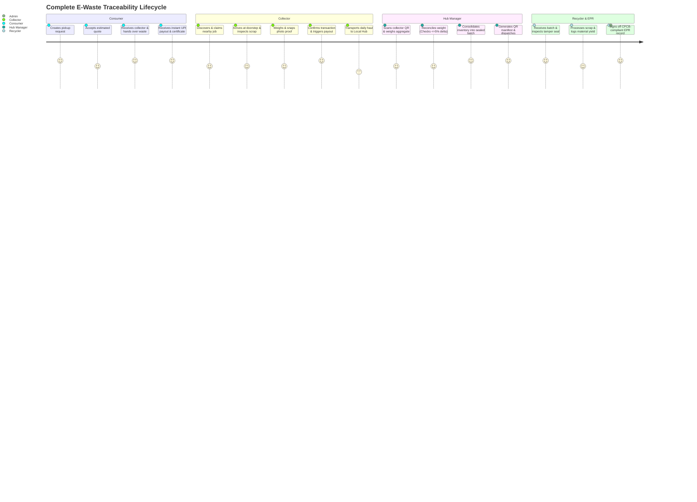

# Product Requirements Document (PRD) — EcoTrace India

**Document Version:** 1.0.0  
**Status:** Approved for Implementation  
**Target Release:** MVP v1.0  
**Project Lead:** Unified Architecture & Product Team  
**Traceability Code:** `ECO-PRD-V1`

---

## 1. Vision, Problem Statement & Goals

### 1.1 Vision
To transform India's informal, fragmented e-waste collection network into a transparent, digitally organized, and traceable reverse-logistics ecosystem. EcoTrace empowers informal waste collectors (*kabadiwalas*, *raddiwalas*, and scrap dealers) with fair digital valuation while providing consumers with seamless pickup and formal recyclers with tamper-evident, CPCB/EPR-compliant material streams.

### 1.2 Problem Statement
India generates over 1.7 million tonnes of e-waste annually, yet over 90% is handled by the unorganized informal sector using hazardous dismantling techniques. 
1. **Consumers** face lack of door-step collection, arbitrary pricing, and no assurance of green recycling.
2. **Informal Collectors** suffer from volatile middleman pricing, inaccurate mechanical scales, and exclusion from formal digital financial systems.
3. **Formal Recyclers & Aggregation Hubs** struggle with contaminated material batches, lack of origin traceability, severe weight discrepancies, and bureaucratic Extended Producer Responsibility (EPR) certification overhead.

### 1.3 Core Product Principles
* **Digitize, Do Not Replace:** Organize the existing informal network rather than attempting to displace traditional collectors.
* **Traceability at Every Hand-off:** Every kilogram of electronic scrap is tracked through an unbroken custody chain: `Consumer -> Collector -> Hub -> Recycler -> EPR Certificate`.
* **Advisory AI, Deterministic Financials:** AI assists with material grading and fraud alerts, but humans and locked pricing catalogs govern all money and weight calculations.

### 1.4 Goals
* **G-1:** Enable doorstep e-waste pickup requests with immediate category-based pricing estimation in $\le 60$ seconds.
* **G-2:** Equip field collectors with a mobile-first, bilingual (English/Hindi) workflow that functions reliably even with intermittent connectivity.
* **G-3:** Guarantee tamper-evident material custody with QR-code manifests and automated discrepancy flagging ($>5\%$ weight variation locks approval).
* **G-4:** Provide formal recyclers and brand producers with audit-ready EPR transaction records aligning with India's Central Pollution Control Board (CPCB) guidelines.

### 1.5 Non-Goals
* **NG-1:** We do not operate an online marketplace for refurbished secondary electronics (no buyer-to-buyer e-commerce).
* **NG-2:** We do not build a proprietary payment gateway; we integrate trusted providers (Razorpay / RazorpayX) with sandbox simulation.
* **NG-3:** We do not manufacture hardware scales; collectors manually input calibrated digital scale readouts with mandatory photographic proof.

---

## 2. Target Personas

| Persona | Role / Description | Primary Pain Points | Key Jobs to be Done |
| :--- | :--- | :--- | :--- |
| **P-1: Priya Sharma** (Consumer) | Urban apartment resident, tech professional with stockpiled old electronics. | Unclear scrap value, inconvenient drop-off centers, data privacy fears regarding old devices. | Book doorstep pickup, get fair pre-estimate, receive instant digital UPI payout, obtain green recycling certificate. |
| **P-2: Ramesh Kumar** (Collector) | Local *kabadiwala* / independent scrap dealer operating a three-wheeler. | Exploitative wholesale middlemen, manual paper logs, unpredictable daily job flow. | Discover nearby collection jobs, input item weights with photo proof, receive direct digital wallet payouts. |
| **P-3: Anil Verma** (Hub Manager) | Supervisor at a ward-level or suburban aggregation facility. | Inbound weight tampering, stock leakage, sorting bottlenecks, messy bulk dispatch records. | Scan inbound collector QR codes, verify bulk scale weights, reconcile discrepancies, pack and seal batch dispatches. |
| **P-4: Dr. Sunita Rao** (Recycler Lead) | Plant Operations Director at a CPCB-registered recycling refinery. | Impure scrap loads, missing provenance for EPR compliance, manual paperwork audits. | Receive manifested batches, log metallurgical yield recoveries (gold, copper, plastics), auto-generate EPR certificates. |
| **P-5: Rajesh Mehta** (Admin / Compliance) | Platform Operations and Environmental Auditor. | Fraudulent scrap claims, regional pricing disputes, material loss anomalies across transit. | Monitor real-time platform KPIs, adjust regional price catalogs, inspect fraud/discrepancy alerts, audit logs. |

---

## 3. End-to-End User Journeys



---

## 4. Feature List & Prioritization (MVP vs. Later)

| Feature ID | Feature Name | Description | Priority | Target Release |
| :--- | :--- | :--- | :--- | :--- |
| **FEAT-01** | Role-Based Access Control (RBAC) | Authentication for 5 distinct roles via JWT cookies and SMS OTP. | **P0** | MVP |
| **FEAT-02** | Consumer Pickup Creation | Category selector, estimated weight calculator, address picker, slot booking. | **P0** | MVP |
| **FEAT-03** | Collector Proximity Job Feed | Real-time list of available pickups sorted by distance (Haversine formula). | **P0** | MVP |
| **FEAT-04** | Field Weigh-In & Photographic Proof | Digital weight entry ($\le 3$ decimal places) + camera image upload. | **P0** | MVP |
| **FEAT-05** | Category Pricing Engine | Deterministic valuation based on category base rates and live grade. | **P0** | MVP |
| **FEAT-06** | Digital Payout & Collector Wallet | Idempotent payment processing with dual-mode Razorpay / Sandbox. | **P0** | MVP |
| **FEAT-07** | Advisory AI Waste Classifier | Vision-based advisory categorization and grade recommendation. | **P0** | MVP |
| **FEAT-08** | Hub Inbound Intake & Weight Reconciliation | Compare collector claimed weight vs hub scale; $>5\%$ flag trigger. | **P0** | MVP |
| **FEAT-09** | Batch Consolidation & QR Manifest | Bundle category items into a sealed batch with printable QR code manifest. | **P0** | MVP |
| **FEAT-10** | Recycler Batch Receipt & Yield Logging | Log gross/net weight and recovered raw materials (metals, plastics, glass). | **P0** | MVP |
| **FEAT-11** | CPCB-Compliant EPR Certificate Generator | Tamper-evident PDF certificate with verifiable SHA-256 hash and QR. | **P0** | MVP |
| **FEAT-12** | Immutable Audit Log & Fraud Monitoring | Comprehensive trail for status changes, weight revisions, and pricing overrides. | **P0** | MVP |
| **FEAT-13** | Bilingual UI (English & Hindi) | Full i18n support with icon-assisted flows for informal collectors. | **P1** | MVP |
| **FEAT-14** | Offline Collector PWA Sync | IndexedDB caching for weigh-in records during network dropouts. | **P1** | MVP |
| **FEAT-15** | Dynamic Route Optimization | Multi-stop navigation route recommendations for collectors. | **P2** | Later |
| **FEAT-16** | Automated CPCB National Portal API Sync | Direct government portal API integration for real-time filing. | **P2** | Later |
| **FEAT-17** | ML Dynamic Market Scrap Pricing | Automated pricing updates based on international London Metal Exchange (LME) rates. | **P2** | Later |

---

## 5. Functional Requirements (FR)

### Module 1: Identity & Authentication
* **FR-001 (Registration & Role Onboarding):** The system shall allow users to register under one of five roles (`CONSUMER`, `COLLECTOR`, `HUB_MANAGER`, `RECYCLER`, `ADMIN`). Collectors must submit collector type (`KABADIWALA`, `RAGPICKER`, `JUNK_COLLECTOR`, `FIELD_AGENT`, `SCRAP_DEALER`) and service radius.
* **FR-002 (Authentication Mechanism):** Consumers and collectors shall be able to log in using an Indian mobile phone number (`^[6-9][0-9]{9}$`) with a 6-digit OTP. Hub Managers, Recyclers, and Admins shall log in via Email and strong password (minimum 8 characters with upper, lower, digit, special character).
* **FR-003 (Session Management):** The system shall issue short-lived JWT access tokens (15-minute lifespan) and secure, HTTP-only refresh tokens (7-day lifespan) stored in secure cookies.

### Module 2: Consumer Pickup Booking
* **FR-004 (Itemized Request Creation):** The system shall allow a consumer to create a pickup request by selecting one or more e-waste categories (`PCB_HIGH_GRADE`, `PCB_LOW_GRADE`, `LITHIUM_BATTERY`, `DISPLAY_UNIT`, `MIXED_APPLIANCE`, `PLASTIC_CASING`, `METALS`, `OTHER_E_WASTE`), estimating weight, picking a saved address, and selecting a preferred time slot.
* **FR-005 (Estimated Valuation):** The system shall display an estimated price range computed from the category base rate prior to final confirmation.
* **FR-006 (Pickup Status Tracking):** The consumer shall be able to view real-time state transitions: `REQUESTED` $\rightarrow$ `ASSIGNED` $\rightarrow$ `COLLECTOR_ARRIVED` $\rightarrow$ `COLLECTED` $\rightarrow$ `PAYMENT_PENDING` $\rightarrow$ `COMPLETED`.

### Module 3: Collector Field Operations
* **FR-007 (Proximity Job Discovery):** The system shall calculate distances between collector coordinates and open pickups, displaying available jobs within the collector's configured service radius (default: 10 km).
* **FR-008 (Job Claiming):** A collector shall be able to claim an unassigned pickup. Once claimed, the status changes to `ASSIGNED` and is locked against concurrent claims.
* **FR-009 (Doorstep Weigh-in & Photographic Evidence):** The collector must enter the verified weight (kg, up to 3 decimal places, minimum 0.050 kg) for each category item and upload at least one proof photograph.
* **FR-010 (Advisory AI Grading):** Upon photo upload, the system shall optionally call the advisory AI endpoint returning `predictedCategory` and `confidenceScore`. The collector or consumer retains authority to confirm or override the category.
* **FR-011 (Final Price Lock):** The system shall compute `finalAmount = actualWeightKg * pricePerKg`. The price per kg must be snapshotted from the active `PriceCatalog` and locked into the transaction record permanently.

### Module 4: Financials & Digital Settlements
* **FR-012 (Idempotent Payment Trigger):** Upon consumer confirmation of weight and price, the system shall trigger a payment with a client-generated UUID `idempotencyKey`. Repeated submissions with the same key shall return the existing payment status without double-charging.
* **FR-013 (Collector Commission & Wallet):** The collector's internal wallet shall be credited with their agreed collection commission immediately upon successful hub drop-off or pickup completion.
* **FR-014 (Payment Audit Immutability):** Payment records shall never be deleted or updated in place; failed or refunded transactions must create new balancing ledger entries.

### Module 5: Hub Aggregation & Discrepancy Control
* **FR-015 (Collector Inbound QR Scanning):** The hub manager shall scan the collector’s drop-off QR code to fetch the itemized list of claimed collections.
* **FR-016 (Weight Verification & Reconciliation):** The hub manager shall record the physical gross weight of the inbound lot. If:
  $$\frac{|\text{HubWeight} - \text{CollectorWeight}|}{\text{CollectorWeight}} > 0.05 \quad (5\%)$$
  the system shall transition the lot to `FLAGGED_DISCREPANCY`, issue a high-priority alert to the Admin dashboard, and require manual supervisor override.
* **FR-017 (Category Inventory Stocking):** Reconciled materials shall be credited to the hub’s real-time category inventory balances (`InventoryItem`).
* **FR-018 (Batch Consolidation & QR Manifestation):** The hub manager shall assemble inventory into a sealed `Batch` (single or mixed compatible categories), assigning a unique `batchCode`, sealing the container, and generating a printable QR code manifest linking to batch provenance.

### Module 6: Recycler Operations & EPR Compliance
* **FR-019 (Batch Inbound Verification):** Recyclers shall view incoming manifested shipments, scan the batch QR code, verify physical seal integrity, and accept or reject the batch.
* **FR-020 (Processing & Yield Recording):** Recyclers shall log processing outcomes, specifying recovered weights for copper, gold, aluminium, plastics, and non-recyclable hazardous residue.
* **FR-021 (EPR Certificate Issuance):** The system shall auto-generate an immutable `EprRecord` linking the originating batch, certified net weight, recycler CPCB registration number, and recipient brand name, outputting a signed PDF certificate.

### Module 7: Administration, Governance & Security
* **FR-022 (Price Catalog Administration):** Administrators shall manage regional base, minimum, and maximum rates per kg. Any price modification must generate an audit log recording `userId`, timestamp, old rate, and new rate.
* **FR-023 (Fraud & Anomaly Flagging):** The system shall flag anomalous activity including duplicate image hashes, collections $>100\text{ kg}$ in domestic categories, or collectors with discrepancy rates $>10\%$ over 5 jobs.
* **FR-024 (Immutable Audit Logging):** All critical state transitions across Pickups, Batches, Payments, and User Verifications must be recorded in the `AuditLog` table.
* **FR-025 (Soft Deletion & Data Retention):** The system shall forbid hard deletion of financial, operational, or identity records, relying strictly on `status` flags and timestamped archival.

---

## 6. Non-Functional Requirements (NFR)

* **NFR-001 (Performance & Latency):** All core REST API endpoints must respond with $p95 < 250\text{ ms}$ under a baseline load of 50 concurrent requests. Static assets and dashboard screens must achieve a Google Lighthouse performance score $\ge 90$.
* **NFR-002 (Availability & Reliability):** Target $99.9\%$ operational uptime during peak collection hours (07:00 to 20:00 IST). Background jobs must use retry strategies with exponential backoff.
* **NFR-003 (Mobile Responsiveness & PWA):** The collector interface must be 100% functional on standard low-end Android mobile viewports ($360\text{px}$ width), supporting offline local data caching of form entries.
* **NFR-004 (Accessibility & Touch Ergonomics):** WCAG 2.1 Level AA compliance. Minimum touch target size of $48\times 48\text{ px}$ for all primary collector field buttons. Color contrast ratio $\ge 4.5:1$.
* **NFR-005 (Localization - i18n):** User interfaces for Consumers and Collectors must offer full Hindi and English localization, with persistent language toggles stored in profile and localStorage.
* **NFR-006 (Data Compliance & Privacy):** Adherence to the **Digital Personal Data Protection Act (DPDP Act 2023, India)**. Consumer phone numbers and exact home addresses must be masked from collectors until a job is explicitly claimed, and deleted from collector cached views post-completion.

---

## 7. Success Metrics & Key Performance Indicators (KPIs)

```text
+------------------------------+---------------------------+---------------------------+
| Metric                       | Baseline / Target (MVP)   | Measurement Method        |
+------------------------------+---------------------------+---------------------------+
| Doorstep Collection Success  | >= 85% completion rate    | Completed vs Cancelled    |
| Average Job Turnaround       | < 4 hours from request    | Timestamp delta           |
| Weight Discrepancy Rate      | < 2.5% of total batches   | Discrepancy audit log     |
| Collector Earnings Uplift    | +20% vs informal baseline | Collector wallet data     |
| Traceability Integrity       | 100% batches linked to QR | Recycler receipt records  |
| EPR Audit Compliance         | Zero failed audit checks  | CPCB inspection reports   |
+------------------------------+---------------------------+---------------------------+
```

---

## 8. Monetization Model & Unit Economics

EcoTrace India operates on a **Reverse-Logistics Spread & Compliance Fee** model:

```text
[Consumer Payout]                 [Collector Payout]               [Recycler Purchase]
Consumer receives               Collector receives               Recycler pays
₹40/kg for PCB Scrap            ₹15/kg collection incentive      ₹75/kg industrial market rate
       \                                /                                /
        \                              /                                /
         +----------------------------+--------------------------------+
                                      |
                           Gross Spread: ₹20/kg
                       - ₹5/kg Hub Aggregation Cost
                       = Platform Net Margin: ₹15/kg
                       + ₹3/kg EPR Certification Royalty
```

* **Revenue Stream 1 (Material Spread):** The arbitrage between bulk industrial scrap prices paid by formal smelters/refiners and the base catalog prices paid at doorstep collection.
* **Revenue Stream 2 (EPR Traceability Royalty):** Fixed fee per kilogram certified paid by electronics producers/importers fulfilling CPCB Extended Producer Responsibility quotas.

---

## 9. Risks, Dependencies & Open Questions

### 9.1 Risks & Mitigations
* **Risk 1 (Collector Digital Hesitation):** Informal collectors may find digital forms cumbersome or fear taxation.  
  *Mitigation:* Simple phone OTP login, large audio/icon cues, instant cash/UPI options, and bilingual support.
* **Risk 2 (Scale & Weighing Tampering):** Inaccurate scale calibration at doorstep.  
  *Mitigation:* Mandatory photograph of scale readout with item; second verification at Hub platform scale with $>5\%$ automatic lockout.
* **Risk 3 (Battery Fire Hazards):** Damaged Lithium-Ion batteries posing thermal runaway risks during transit.  
  *Mitigation:* Mandatory battery condition flagging (`INTACT`, `SWOLLEN`, `PUNCTURED`) with special handling protocols shown on collector UI.

### 9.2 Dependencies
* **Third-Party Payment Gateway:** Razorpay / RazorpayX API availability for instant UPI payout triggers.
* **Map Services:** OpenStreetMap Leaflet / Google Maps API for distance calculation and routing.
* **Cloud Storage:** Cloudinary or AWS S3 for hosting scale readout photos and signed EPR PDF manifests.

### 9.3 Open Questions
* **[OPEN QUESTION - OQ-01]:** Should collectors be allowed to receive cash advances from hub managers for daily float? *(Assumption for MVP: Collectors utilize personal float or platform digital escrow payout directly to consumer).*
* **[OPEN QUESTION - OQ-02]:** Will state-level pollution control boards (SPCBs) require custom regional certificate formats? *(Assumption for MVP: Structure adheres to CPCB Central Schedule III standard).*

---

## 10. Out-of-Scope (Explicit Boundaries)

1. **Refurbished Device Marketplace:** Direct consumer-to-consumer second-hand gadget selling is out of scope.
2. **Proprietary Hardware Development:** No custom Bluetooth/IoT digital scales will be manufactured; manual photo verification is enforced.
3. **Hazardous Chemical Processing:** Platform handles material logistics, aggregation, and certified transfer; chemical extraction operations remain strictly within licensed third-party recycler facilities.
